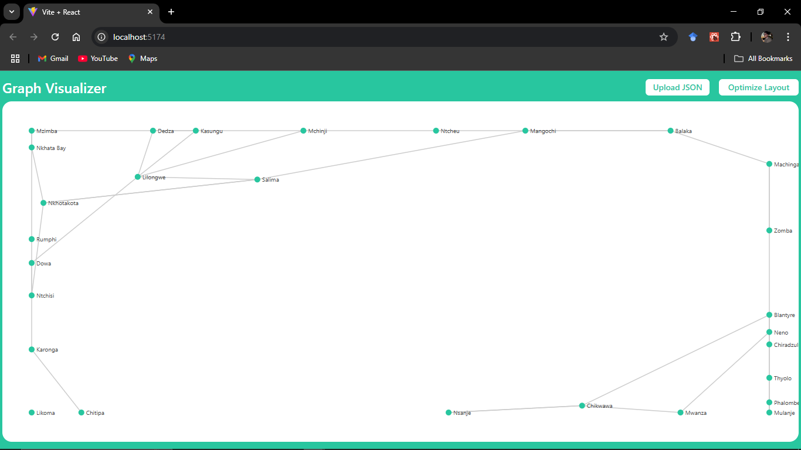
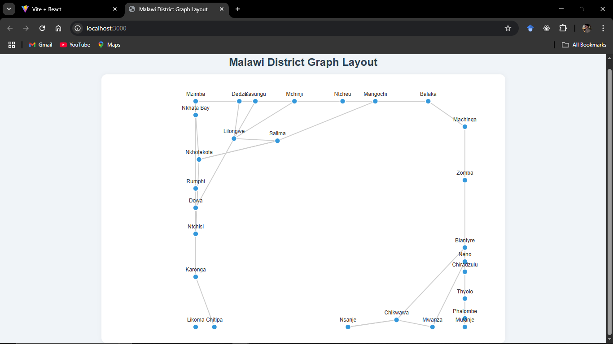

# 🇲🇼 Malawi District Graph Visualization

This project visualizes Malawi’s 28 districts as a graph, where each node represents a district and each edge represents a neighboring (adjacent) district. The layout is computed using a force-directed algorithm and rendered using D3.js.

There are **two approaches** available in this project:

---

## Two Approaches

### 🔹 1. `simple_js/` – Static HTML + JavaScript

- Uses plain JavaScript and D3.js
- Runs a Node.js script (`forceLayout.js`) to generate `output.json` from `data.json`
- Displays the graph in `index.html` using D3.js

Details: [`simple_js/README.md`](./simple_js/README.md)

---

### 🔹 2. `react/` – React App with Upload & Optimization

- Built using React and D3.js
- Allows uploading your own `.json` graph file via a file input
- Includes a button to optimize and re-render the layout interactively in the browser

Details: [`react/README.md`](./react/README.md)

---

## Project Structure

malawi-district-graph-visualization/
├── react/ # React version (interactive)
├── simple_js/ # Static version (plain HTML + D3.js)
└── README.md # You are here

---
## React Graph Screenshot

## HTML Graph Screenshot
